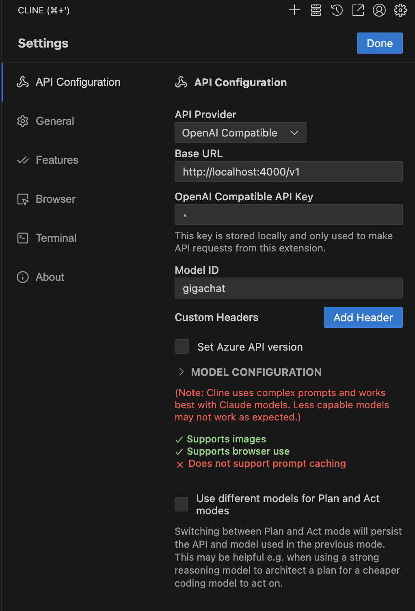
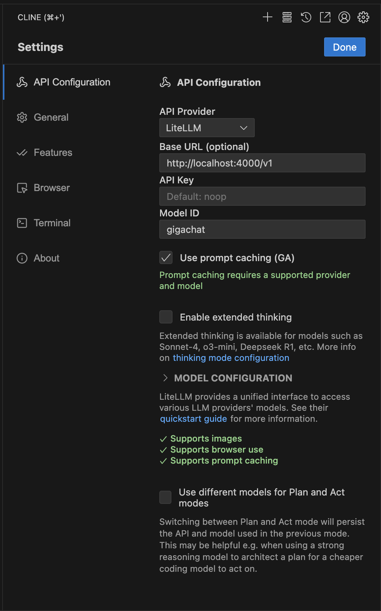

# Интеграция GigaChat с LiteLLM

[](https://github.com/stp008/litellm-gigachat/stargazers)
[](https://pypi.org/project/litellm-gigachat/)

[](https://python.org)
[](https://github.com/BerriAI/litellm)
[](LICENSE)
[](https://developers.sber.ru/portal/products/gigachat-api)

**Полнофункциональная интеграция GigaChat API с LiteLLM** - готовое решение для подключения российской языковой модели Сбер GigaChat через стандартный OpenAI-совместимый интерфейс. Включает автоматическое обновление токенов, преобразование контента и полную совместимость с AI-ассистентом Cline.

## 📚 Документация

**[Полная документация](docs/README.md)** | **[FAQ](docs/FAQ.md)** | **[Тестовые запросы](docs/TEST_REQUESTS.md)** | **[Причины несовместимости с OpenAI API](docs/GIGACHAT_COMPATIBILITY.md)**

## 🚀 Основные возможности

-  **Автоматическое обновление токенов**
-  **Автоматическая настройка сертификатов**
-  **Совместимость с Cline** 
-  **Streaming поддержка**

## 📦 Установка

### Через pip (рекомендуется)

```bash
# Установка пакета
pip install litellm-gigachat

# Проверка установки
litellm-gigachat --version
```

### Из исходников (для разработки)

```bash
# 1. Клонирование репозитория
git clone https://github.com/stp008/litellm-gigachat.git
cd litellm-gigachat

# 2. Установка в режиме разработки
pip install -e .

# 3. Проверка установки
litellm-gigachat --version
```

## 🎯 Быстрый старт

### 1. Настройка API ключа

```bash
# Установите ваш authorization key от GigaChat
export GIGACHAT_AUTH_KEY="ваш_authorization_key"
```

### 2. Запуск прокси-сервера

```bash
# Через установленный пакет (рекомендуется)
litellm-gigachat

# Через исходники (для разработки)
python tools/start_proxy.py

# С кастомными параметрами (только для установленного пакета)
litellm-gigachat --host 127.0.0.1 --port 8000

# С кастомным файлом конфигурации
litellm-gigachat --config my_config.yml

# Справка по командам
litellm-gigachat --help
```

**Примечание:** Если вы работаете с исходниками проекта (клонировали репозиторий), используйте `python tools/start_proxy.py`. Если установили пакет через pip, используйте команду `litellm-gigachat`.

### 3. Использование через OpenAI API

```python
import openai

client = openai.OpenAI(
    base_url="http://localhost:4000",
    api_key="any-key"  # Токен управляется автоматически
)

response = client.chat.completions.create(
    model="gigachat",
    messages=[{"role": "user", "content": "Привет, GigaChat!"}]
)

print(response.choices[0].message.content)
```

### 4. Использование через LiteLLM (программно)

```python
import litellm_gigachat

# Автоматическая настройка интеграции
litellm_gigachat.setup_litellm_gigachat_integration()

# Использование через LiteLLM
import litellm

response = litellm.completion(
    model="openai/GigaChat",
    api_base="https://gigachat.devices.sberbank.ru/api/v1",
    api_key=litellm_gigachat.get_gigachat_token(),
    messages=[{"role": "user", "content": "Привет!"}]
)

print(response.choices[0].message.content)
```

### Использование через Cline

Допустимо использовать сервер как в качестве OpenAI совместимого провайдера, так и в качестве LiteLLM провайдера. В случае использования второго варианта появляется больше доступных опций.

##### Настройки OpenAI Compatible провайдера:


##### Настройка LiteLLM провайдера:


В настройках Cline укажите следующие параметры:

**Основные настройки:**
1. **API Provider**: Выберите `OpenAI Compatible` или `LiteLLM` из выпадающего списка
2. **Base URL**: Введите `http://localhost:4000` (без слэша в конце)
3. **API Key**: Введите любое значение, например `gigachat-key` (токен управляется автоматически)
4. **Model**: Выберите одну из моделей:
   - `gigachat` - основная модель (рекомендуется для начала)
   - `gigachat-pro` - продвинутая модель для сложных задач
   - `gigachat-max` - модель с максимальными возможностями

#### 4.3 Дополнительные настройки (опционально)

- **Temperature**: 0.7 (для баланса между креативностью и точностью)
- **Max Tokens**: 4000 (максимальная длина ответа)
- **Timeout**: 60 секунд


### Тестирование интеграции с Cline

```bash
python test_cline_integration.py
```

## 🔧 CLI команды

После установки пакета доступна команда `litellm-gigachat` для управления прокси-сервером:

### Основные команды

| Команда | Описание |
|---------|----------|
| `litellm-gigachat` | Запуск прокси-сервера с настройками по умолчанию |
| `litellm-gigachat --help` | Показать справку по всем доступным параметрам |
| `litellm-gigachat --version` | Показать версию пакета |

### Параметры командной строки

| Параметр | Описание | По умолчанию |
|----------|----------|--------------|
| `--host` | Хост для прокси-сервера | `0.0.0.0` |
| `--port` | Порт для прокси-сервера | `4000` |
| `--config` | Путь к файлу конфигурации | `config.yml` |

### Примеры использования

```bash
# Запуск на localhost с портом 8000
litellm-gigachat --host 127.0.0.1 --port 8000

# Использование кастомного файла конфигурации
litellm-gigachat --config /path/to/my_config.yml

# Запуск только на локальном интерфейсе
litellm-gigachat --host localhost --port 3000
```

## 📊 Доступные модели

| Модель API | Описание |
|------------|----------|
| `gigachat` | Основная модель для общих задач |
| `gigachat-pro` | Продвинутая модель для сложных задач |
| `gigachat-max` | Модель с максимальными возможностями |

## 🧪 Тестирование

### После установки через pip

```bash
# Проверка версии и CLI
litellm-gigachat --version
litellm-gigachat --help

# Запуск прокси-сервера (требует GIGACHAT_AUTH_KEY)
export GIGACHAT_AUTH_KEY="ваш_ключ"
litellm-gigachat

# Тестирование через curl (в другом терминале)
curl -X POST http://localhost:4000/v1/chat/completions \
  -H "Content-Type: application/json" \
  -H "Authorization: Bearer any-key" \
  -d '{
    "model": "gigachat",
    "messages": [{"role": "user", "content": "Привет!"}]
  }'
```

### При разработке из исходников

```bash
# Базовая функциональность
python tests/test_basic_functionality.py

# Интеграция с Cline
python tests/test_cline_integration.py

# Интерактивные примеры
python examples/basic_usage.py

# Все тесты
python -m pytest tests/
```

### Быстрая проверка работоспособности

```python
# test_quick.py
import openai

client = openai.OpenAI(
    base_url="http://localhost:4000",
    api_key="test-key"
)

try:
    response = client.chat.completions.create(
        model="gigachat",
        messages=[{"role": "user", "content": "Тест"}]
    )
    print("✅ Интеграция работает!")
    print(f"Ответ: {response.choices[0].message.content}")
except Exception as e:
    print(f"❌ Ошибка: {e}")
```

## 🚨 Устранение неполадок

### Ошибка "Authorization key не найден"
```bash
# Установите переменную окружения
export GIGACHAT_AUTH_KEY="ваш_ключ"

# Проверьте, что ключ установлен
echo $GIGACHAT_AUTH_KEY
```

### Проблемы с CLI командой
```bash
# Проверьте, что пакет установлен
pip list | grep litellm-gigachat

# Переустановите пакет при необходимости
pip install --upgrade litellm-gigachat

# Проверьте версию
litellm-gigachat --version
```

### Проблемы с прокси-сервером
```bash
# Убедитесь, что прокси запущен
litellm-gigachat

# Проверьте, что порт свободен
lsof -i :4000

# Запустите на другом порту
litellm-gigachat --port 8000
```

### Проблемы с Cline
- Убедитесь, что прокси запущен: `litellm-gigachat`
- Проверьте URL: `http://localhost:4000`
- Проверьте, что порт доступен: `curl http://localhost:4000/health`
- Тест интеграции: `python tests/test_cline_integration.py`

### Проблемы с сертификатами
```bash
# Проверьте подключение к GigaChat API
curl -k https://gigachat.devices.sberbank.ru/api/v1/models

# При проблемах с SSL попробуйте переустановить certifi
pip install --upgrade certifi
```

Полное руководство: **[❓ FAQ](docs/FAQ.md)**

## 🔗 Полезные ссылки

- **[📚 Полная документация](docs/README.md)** - подробное руководство
- **[❓ FAQ](docs/FAQ.md)** - часто задаваемые вопросы
- **[🔧 API Reference](docs/TEST_REQUESTS.md)** - примеры запросов

---

**Лицензия**: MIT | **Поддерживаемые версии**: Python 3.8+
